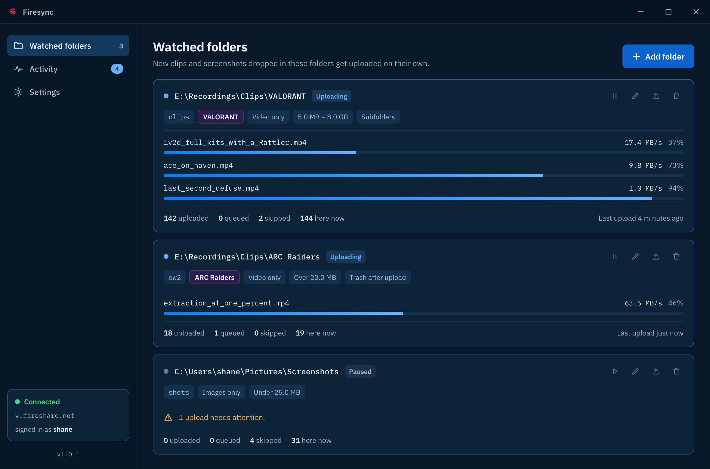
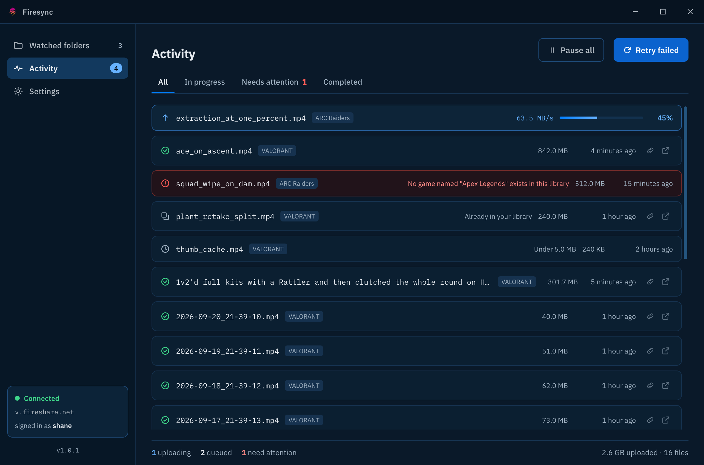
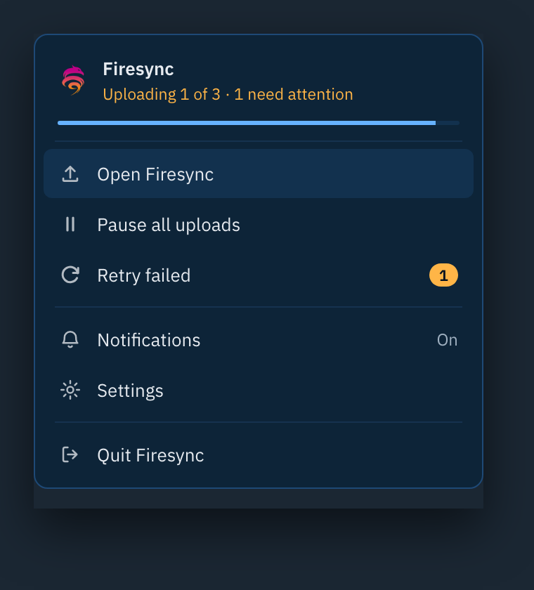
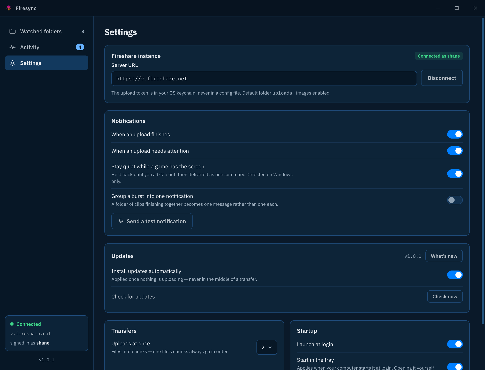

# Firesync

**Firesync puts your game clips and screenshots into your own [Fireshare](https://github.com/fireshare-app/fireshare) library, by itself.**

Point it at the folder your recorder saves to. Then stop thinking about it. Record a clip, keep
playing, and by the time you tab out it is already on your server and ready to share — no dragging
files into a browser, no remembering which ones you have already done.

It sits in your system tray, starts with your computer, and stays out of the way.



## Why you might want it

- **You record a lot and share a little.** Clips pile up on disk and never make it anywhere. Firesync
  moves them the moment they are written.
- **You do not want to babysit it.** It knows what it has already sent, so nothing goes up twice, and
  a clip that fails at 3am is retried without you.
- **You want your clips on your own server.** Everything goes to your Fireshare instance. Firesync
  talks to nothing else except GitHub, and only to check for its own updates.
- **You are playing.** Notifications stay quiet while a game has the screen and arrive once you tab
  out.

## Getting started

### 1. Install it

Download the installer for your system from the
[latest release](https://github.com/fireshare-app/firesync/releases/latest):

| System | File |
| --- | --- |
| Windows | `Firesync_<version>_x64-setup.exe` |
| Linux (Debian, Ubuntu, Mint) | `Firesync_<version>_amd64.deb` |
| Linux (Fedora, RHEL) | `Firesync-<version>-1.x86_64.rpm` |
| Linux (anything else) | `Firesync_<version>_amd64.AppImage` |

> **Windows will warn you the first time.** The installer is not code-signed — a certificate costs a
> few hundred a year — so SmartScreen shows a blue box. Click **More info**, then **Run anyway**.
> This is expected and will keep happening until enough people install it for Windows to trust it.

### 2. Create an upload token in Fireshare

In Fireshare, go to **Settings → Security → Upload Tokens** and create one. Copy it — it is shown
once and never again.

A token is not your password. It can only upload, it can be revoked on its own, and Firesync never
sees or stores your actual credentials.

### 3. Connect and add a folder

Open Firesync, paste your Fireshare address and the token, then hit **Add folder** and choose where
your recorder saves. That is the whole setup.

Each folder gets its own rules — which Fireshare folder things land in, which game they are tagged
with, a minimum and maximum size, and whether it takes videos, images or both.

> **Files already in the folder are left alone.** When you add a folder, whatever is in it is
> recorded as a starting point rather than uploaded — otherwise adding a folder with three years of
> clips would immediately start sending three years of clips. Any of them you *do* want are one
> button away, under the folder's upload icon.

## What you get

### Everything that happened, in one list

Every file Firesync has seen, what became of it, and why. Finished uploads have buttons to copy the
link or open the clip in Fireshare.



### A tray panel for the things you actually need mid-game



### Settings that explain themselves



## How it behaves

- **It waits for the recording to finish.** A file is only sent once it has stopped growing and the
  recorder has let go of it, so you never get a half-written clip on your server.
- **It never sends the same file twice.** It remembers every file it has handled. For anything it
  has *not* seen — a folder you add later, or a fresh install — it works out the file's identity
  locally and asks your library whether it already has it before uploading, so re-sending a folder
  you have already uploaded costs a question rather than a transfer.
- **Big files go up in pieces.** A clip interrupted halfway resumes rather than starting over, and a
  server that restarts mid-upload does not cost you the whole file.
- **It retries what is worth retrying.** A server that is down or restarting is waited out. A file
  the server will never accept fails clearly and says why, instead of looping forever.
- **It can clean up after itself.** Optionally move a clip to the recycle bin once the server has
  confirmed it — off by default.
- **It updates itself.** New versions install when nothing is uploading, never mid-transfer. The
  **What's new** button in Settings shows what changed, including releases you skipped.

## What you need

- A **Fireshare instance** you can reach, with upload tokens enabled.
- **Windows 10/11**, or a Linux desktop with GTK 3 and WebKitGTK.

Closing the window does not close Firesync, and costs nothing: the window is thrown away entirely,
and only the small background part that watches folders and uploads keeps running.

---

## Development

```bash
npm install
npm run tauri dev
```

Needs Node 20+ and a Rust toolchain ([rustup](https://rustup.rs)). On Linux you will also need the
[Tauri prerequisites](https://v2.tauri.app/start/prerequisites/) — GTK 3, WebKitGTK and libxdo.

| Command | What it does |
| --- | --- |
| `npm run tauri dev` | Run the app against the Vite dev server |
| `npm run typecheck` | Type-check the frontend without emitting |
| `npm run build` | Build the frontend |
| `cd src-tauri && cargo test` | Run the Rust test suite |

### Layout

```
src-tauri/src/     the Rust core — owns all state, outlives the window
  api/             the Fireshare upload-token API
  queue/           the upload queue, its rules and its retry policy
  ledger/          every file ever seen, in SQLite
  config.rs        settings and per-folder rules, on disk
  secrets.rs       the upload token, in the OS keychain
  commands.rs      what the webview may call
src/               React + TypeScript
  views/           screens
  lib/ipc.ts       typed wrappers over invoke()
```

The Rust core owns every piece of durable state: the ledger, the upload queue, the watcher and the
token. The webview renders that state and can be destroyed at any moment without interrupting a
transfer — which is why closing the window costs nothing and uploads carry on.

## Releasing

Pushing a tag is the whole process:

```bash
# Bump package.json, src-tauri/Cargo.toml and src-tauri/tauri.conf.json, then:
git commit -am "Release 1.0.1" && git tag v1.0.1 && git push --follow-tags
```

`.github/workflows/release.yml` builds Windows and Linux installers, signs them, writes
`latest.json`, and opens a **draft** release. Publishing that draft is what makes every installed
copy offer the update — so a release can be read before it becomes the thing everyone updates to.

**Write `RELEASE_NOTES.md` before tagging.** The workflow reads it into the release body, and
`tauri-action` writes that into `latest.json`, which is where the in-app update dialog and the
What's new panel get their text. A stale file ships silently and confidently describes the wrong
release.

**The signing key lives only in repo secrets**, as `TAURI_SIGNING_PRIVATE_KEY`. Losing it means no
existing install can ever update again, and the only remedy is asking everybody to reinstall by
hand. Keep a backup somewhere that is not the build machine.

## License

Firesync is free software under the [GNU General Public License v3.0](LICENSE) — the same license as
[Fireshare](https://github.com/fireshare-app/fireshare). Use it, read it, change it, pass it on. The
one condition is that a copy you distribute — modified or not — carries those same freedoms with it.

Copyright © 2026 Shane Israel.
